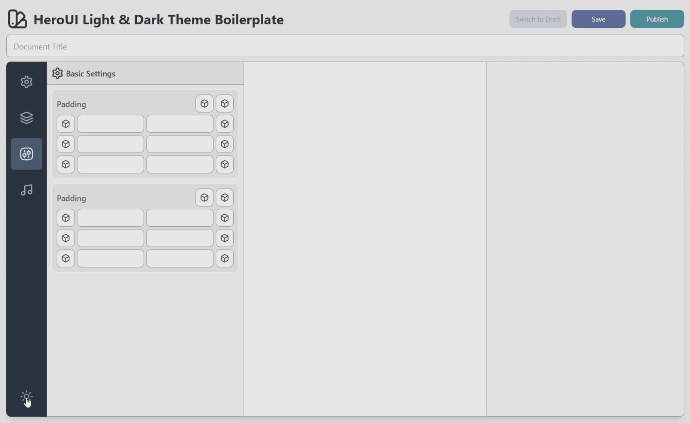
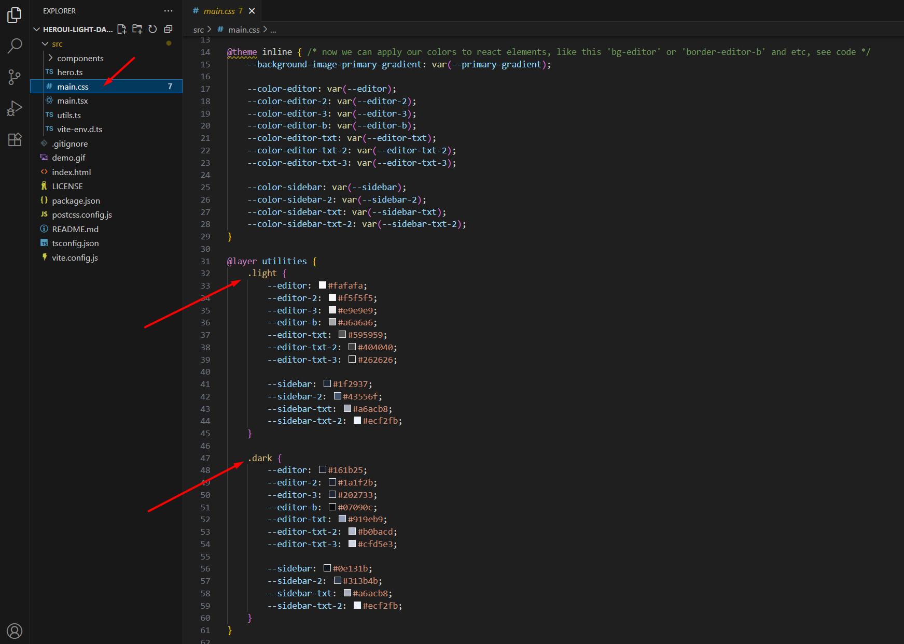
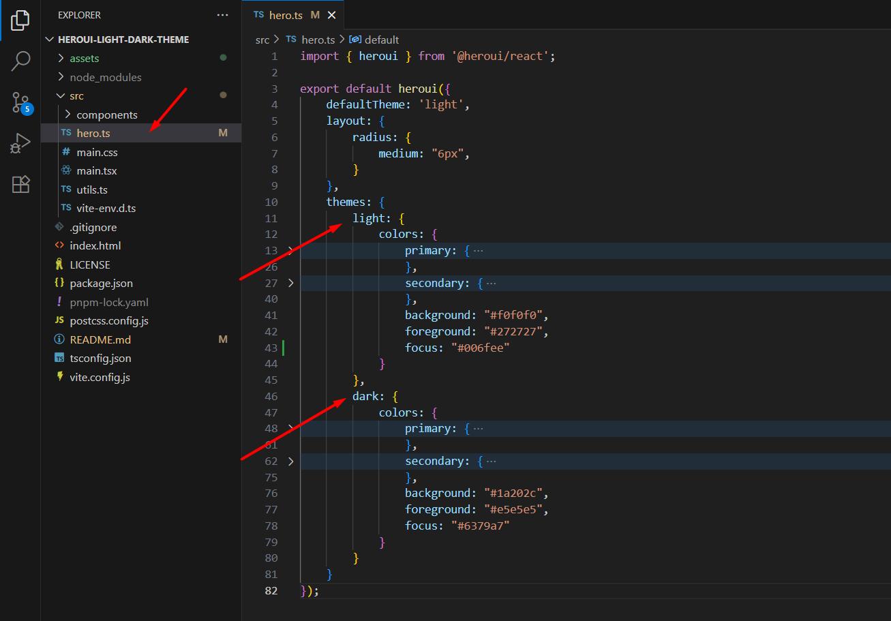

# HeroUI Light & Dark Theme Boilerplate

A fairly simple template demonstrating how to create a web application with light & dark theme support using the HeroUI React component library.

**Getting Started:**

- Clone or download the repository.
- Install dependencies with `npm install` or `yarn install` or `pnpm install`.
- Run `pnpm dev` to start the development server and watch for changes.
- Edit boilerplate files in the `src/` directory.

All color settings for the themes are located in the `main.css` file. Additionally, the `hero.ts` file contains color configurations for the HeroUI library components. Although, in principle, everything could be moved into a single main.css file by simply overriding colors using global variables like --heroui-background, etc., in this case we would need to adhere to the HSL format, which might not be very intuitive or clear.

**Requirements:**
- TypeScript
- React 19
- HeroUI 2.8
- Vite 7.0

Enhance your React development with this clean and practical boilerplate. It showcases seamless light and dark theme integration using the HeroUI component library, offering a ready-to-use foundation for building modern, theme-aware web applications with ease.

Powered by Vite and TypeScript, this template provides a fast, efficient development experience with hot module replacement and streamlined workflows. Whether you're starting a new project or exploring theme customization, this boilerplate makes it simple to get up and running - just clone, install, and start coding.

Perfect for developers who want to implement dynamic theme switching while maintaining full control over styling and component behavior.

## License

[MIT](LICENSE)